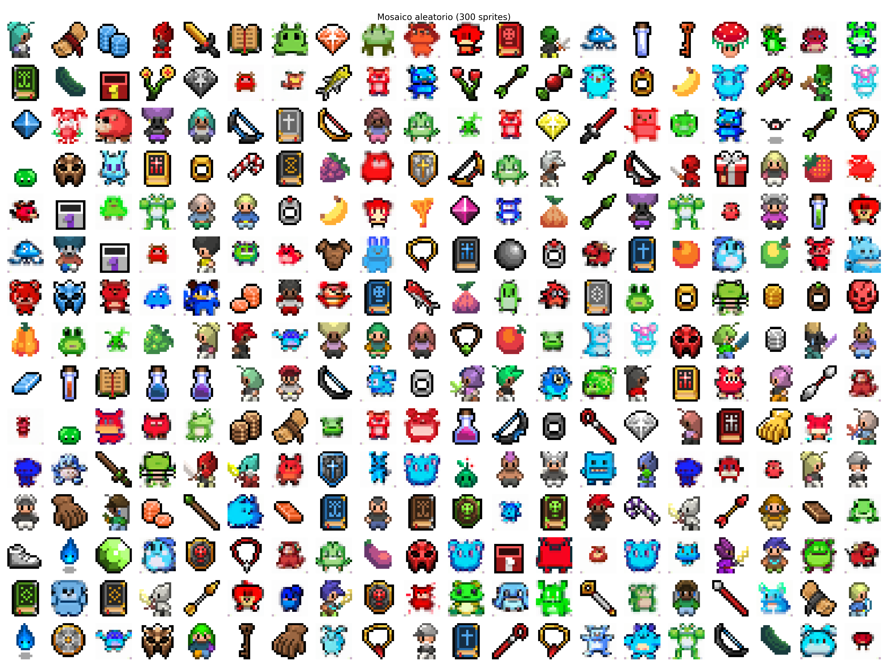
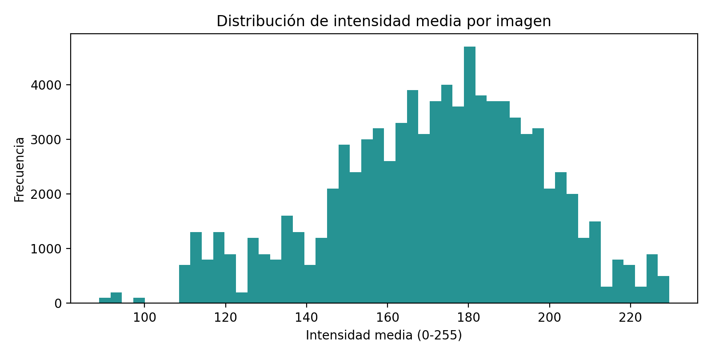
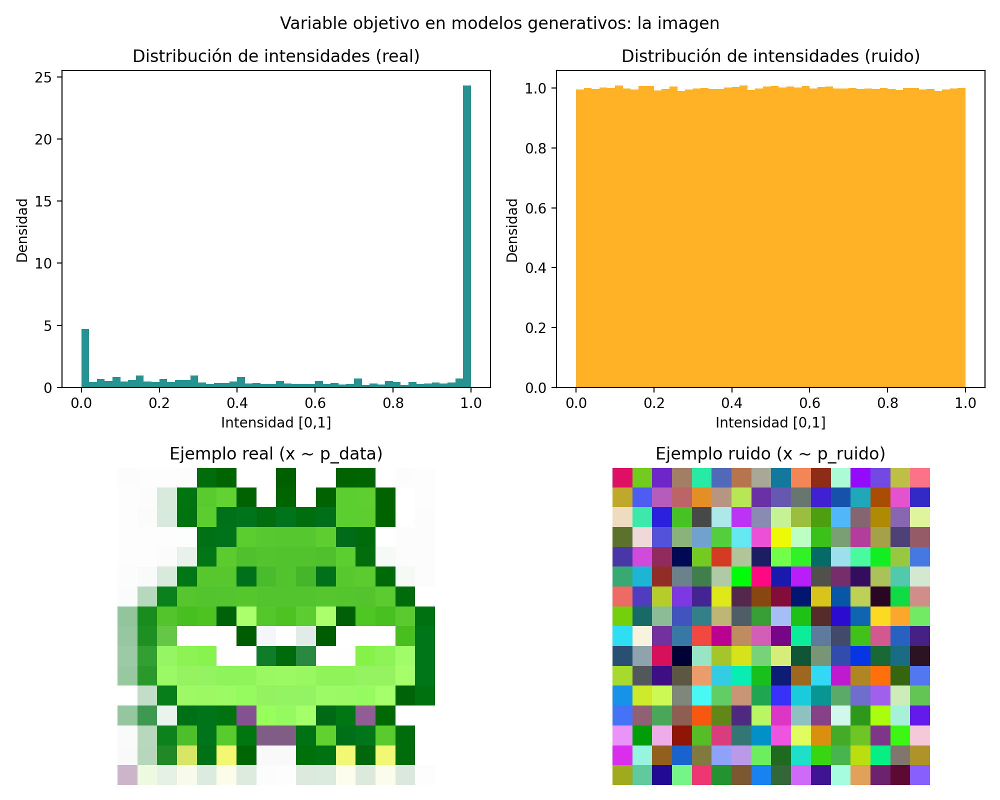
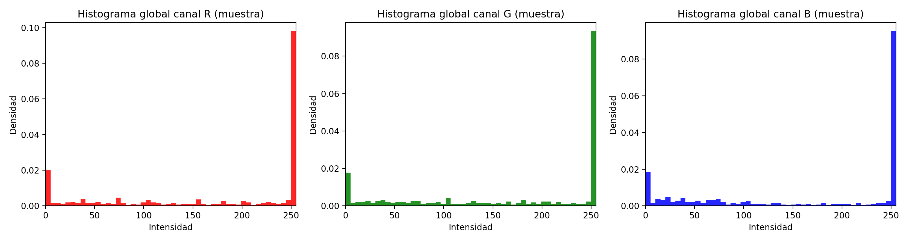
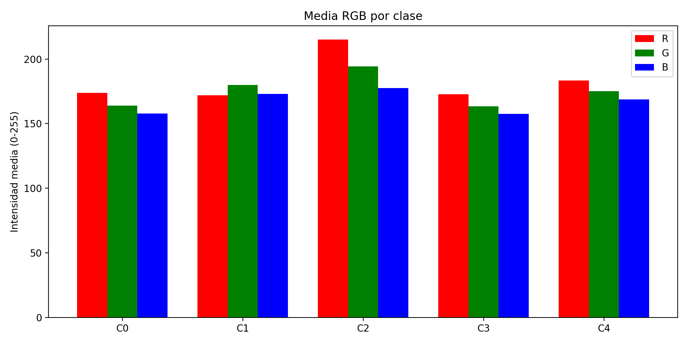
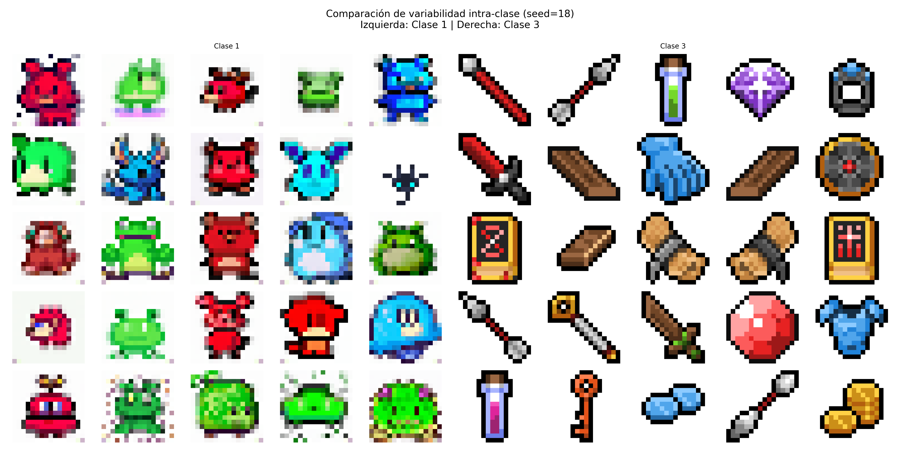
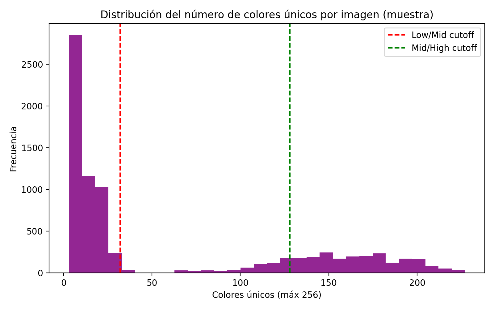
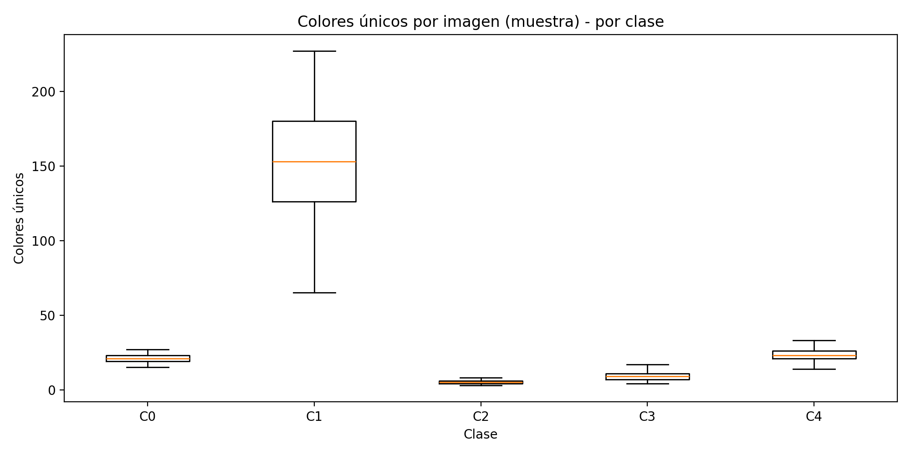

# Reporte de datos (EDA)

Este documento presenta una visión global, técnica y orientada a decisiones de modelado sobre el dataset de pixel art del proyecto. Integra evidencia generada por los módulos EDA en `scripts/eda/`.

Evidencia reproducible:

- Métricas: `reports/eda/eda.json`
- Figuras: `reports/figures/eda/`

Para reproducir el EDA completo:

```bash
.\env\Scripts\python.exe scripts/eda/run_eda.py
```

---

## 1. Resumen general de los datos

### 1.1 Número total de observaciones y consistencia

El dataset contiene **89,400** imágenes. La consistencia se validó cruzando 4 fuentes (ver `eda.json` → `summary_general`):

- `data/raw/sprites.npy`: 89,400 imágenes (formato array)
- `data/raw/sprites_labels.npy`: 89,400 etiquetas (one-hot)
- `data/raw/labels.csv`: 89,400 filas
- `data/raw/images/images/`: 89,400 archivos en disco
- Chequeo de rutas (muestra 500): 0 faltantes

Implicación para el modelado: la canalización de datos es confiable; si un modelo falla, es poco probable que el problema sea “datos faltantes o desalineados”.

### 1.2 Variables presentes (en un dataset de imágenes)

Aunque no hay “columnas” tradicionales, cada observación tiene:

- Matriz de píxeles: **16×16×3** (RGB)
- Etiqueta de clase: **5 clases** (`0..4`, inferidas de one-hot)
- `path`: ruta de la imagen (en `labels.csv`, columna `Image Path`)

Nota sobre “categorías”: la idea original del documento asumía 20 categorías, pero en este proyecto el dataset está anotado en **5 macroclases** (consistente con el uso de `n_cfeat=5` en los experimentos de difusión). En `labels.csv`, la columna `Label` está almacenada como un vector one-hot en texto (por ejemplo: `"[0. 1. 0. 0. 0.]"`), y el pipeline la convierte a enteros `0..4` en `pixel_art_data.npz`.

### 1.3 Tipos de variables

- Numéricas: valores RGB (`uint8` 0–255 en raw; `float32` 0–1 en el dataset intermedio)
- Categórica: clase (`0..4`)
- Texto: ruta de archivo (`Image Path`)

### 1.4 Verificación de faltantes

Validaciones realizadas (ver `eda.json` → `data_quality` y `summary_general`):

- `labels.csv` sin valores faltantes en `Image Index`, `Image Path`, `Label`
- 0 errores de lectura en disco en una muestra de 500 imágenes (PIL)
- `sprites.npy` y `sprites_labels.npy` con el mismo número de filas (89,400)

### 1.5 Distribución general de las imágenes

Mosaico aleatorio (300 sprites) para inspección visual rápida:



Distribución de clases (dataset **no balanceado**):

| Clase | # imágenes |
|---:|---:|
| 0 | 8,000 |
| 1 | 32,400 |
| 2 | 6,000 |
| 3 | 35,000 |
| 4 | 8,000 |

Implicación para el modelado:

- Si entrenamos un modelo condicional por clase, es probable que las clases mayoritarias (1 y 3) dominen el gradiente. Para comparar modelos de forma justa, conviene usar *balanced sampling* o evaluar por clase.
- Al ser todo 16×16, conviene diseñar arquitecturas pequeñas/medianas (U-Nets con 2 niveles de downsampling suelen ser suficientes) y usar interpolación *nearest* al visualizar para evitar blur.

---

## 2. Resumen de calidad de los datos

### 2.1 Presencia de valores faltantes

Reporte exacto (ver `eda.json` → `data_quality`):

- Imágenes sin entrada en CSV: 0 (por conteo consistente)
- Rutas inválidas (muestra 500): 0
- Errores de lectura (muestra 500): 0

### 2.2 Duplicados

Se detectaron **duplicados exactos a nivel de píxel** mediante hash MD5 sobre `sprites.npy`:

- Total: 89,400
- Únicas: 1,722
- Duplicadas: 87,678 (**98.07%**)

Implicación para el modelado:

- En difusión, los duplicados pueden reducir diversidad efectiva y aumentar el riesgo de “memorizar sprites” en lugar de aprender variaciones. Si el objetivo es diversidad, conviene entrenar/evaluar sobre un set deduplicado o reponderar ejemplos.
- Para comparaciones rápidas (experimentos), entrenar con un set deduplicado puede reducir tiempo sin perder cobertura del “estilo” general.

### 2.3 Valores extremos o inconsistencias

Chequeos automáticos:

- Sprites completamente negros: 0
- Sprites completamente blancos: 0

Chequeos de paleta en una muestra de 8,000 (ver `eda.json` → `palette_stats`):

- Imágenes con menos de 3 colores: 0
- Imágenes con más de 50 colores: 2,684
- Imágenes con más de 128 colores: 2,090

Interpretación: “muchos colores” no necesariamente es un error en pixel art; puede indicar sprites con sombreado, dithering o antialias. Lo importante es que no aparecieron casos degenerados (0/1/2 colores) en la muestra.

Distribución de intensidad media por imagen:



### 2.4 Outliers visuales

En este EDA se priorizó evidencia cuantitativa + mosaicos. Como siguiente paso, se recomienda generar una pequeña galería de “outliers” (por ejemplo: top-N por intensidad media, o por número de colores) para revisar casos raros sin sesgo.

### 2.5 Acciones tomadas (dataset intermedio)

El dataset `data/intermediate/pixel_art_data.npz` deja los datos listos para entrenamiento:

- Conversión a `float32`
- Normalización a [0, 1]
- Etiquetas como enteros (`int32`, `0..4`)

Implicación: la mayoría de modelos de difusión/AE pueden consumir el `.npz` directamente sin pasos extra de preprocesamiento.

---

## 3. Variable objetivo (adaptación a difusión)

### 3.1 Por qué la variable objetivo es la imagen

En difusión no se predice una etiqueta: el modelo aprende a aproximar la distribución completa de imágenes `x ~ p_data`. La tarea se construye como:

- forward: agregar ruido a imágenes reales (proceso conocido)
- reverse: aprender a quitar ese ruido paso a paso (proceso aprendido)

### 3.2 Distribución global de las imágenes

Evidencia de “imagen real” vs “ruido” y comparación de intensidades (muestra 2,000):



Además, se observan distribuciones por canal RGB (muestra de píxeles) y medias por clase:




Implicación: preservar el color (3 canales) es importante; convertir a grayscale perdería señal discriminativa y estilística.

### 3.3 Variabilidad intra-clase

Mosaicos 5×5 para dos clases seleccionadas (seed fija) muestran que dentro de una misma clase hay variación visual:



Implicación: un modelo generativo debe tener capacidad para diversidad intra-clase; un condicionamiento por clase (DDPM condicional) ayuda a fijar el “estilo” sin colapsar a una única imagen.

### 3.4 Variabilidad global

PCA sobre imágenes (768 dimensiones flatten):

- 1er componente: 12.13% de varianza
- 10 componentes: 46.88% de varianza acumulada
- 20 componentes: 59.60% de varianza acumulada


La separabilidad en embeddings no lineales (t-SNE) sugiere estructura, pero no clusters “limpios” en un espacio simple:


Implicación: si queremos buena calidad visual, conviene un backbone con no linealidades fuertes (U-Net con residuales/FiLM) más que modelos lineales o demasiado pequeños.

---

## 4. Variables individuales (adaptado a imágenes)

### 4.1 Canales RGB como variables

Estadísticas descriptivas globales por canal (raw `uint8`, 0–255):

| Canal | Media | Std | Min | Q1 | Mediana | Q3 | Max |
|:--:|---:|---:|---:|---:|---:|---:|---:|
| R | 176.36 | 97.38 | 0 | 81 | 250 | 255 | 255 |
| G | 172.60 | 96.57 | 0 | 80 | 235 | 255 | 255 |
| B | 165.55 | 102.19 | 0 | 57 | 244 | 255 | 255 |

### 4.2 Número de colores por imagen

Conteo de colores únicos (muestra 8,000; ver `eda.json` → `palette_stats`):

- Low palette (≤32): 5,277
- Mid palette (33–128): 633
- High palette (>128): 2,090




Implicación: hay clases con paletas significativamente distintas; el condicionamiento por clase puede estabilizar estas diferencias (y CFG puede reforzarlas durante el muestreo).

### 4.3 Estructura espacial (pendiente de automatizar)

La idea original incluye: centrado del sprite, distribución del contenido y heatmaps por clase. Esto es importante porque:

- Si el contenido suele estar centrado, U-Nets pequeños funcionan muy bien.
- Si el contenido está desplazado, conviene usar *small shifts* como augmentation y/o entrenar con padding adecuado.

Recomendación: añadir un módulo EDA que calcule “ratio de píxeles vacíos” y mapas de densidad por clase (heatmaps) para justificar augmentations y decisiones de arquitectura.

### 4.4 Posibles transformaciones (recomendadas para este dominio)

Para pixel art, se recomienda priorizar transformaciones que no introduzcan blur:

- Normalización consistente (ya aplicada en `pixel_art_data.npz`).
- Augmentations leves y respetuosas del estilo:
  - `flip` horizontal (si semánticamente tiene sentido)
  - `shift` pequeño (1–2 píxeles)
  - rotación mínima (≤15°) solo si no rompe el estilo
  - jitter de color muy leve (si se quiere robustez, con cuidado)

Implicación: estas transformaciones son más valiosas si se entrena sobre un set deduplicado, porque “inyectan” variación donde antes había repeticiones exactas.

### 4.5 Relación con la etiqueta (evidencia visual)

Las medias por clase (promedio de imágenes) ayudan a entender qué está codificando la etiqueta:

| C0 | C1 | C2 | C3 | C4 |
|---|---|---|---|---|
|  |  |  |  |  |

Implicación: si el objetivo es controlar “estilo” o “familia visual”, el condicionamiento por clase es una señal adecuada y estable.

---

## 5. Ranking de variables (adaptación a imágenes)

Aunque en modelos generativos no existe un “ranking de variables” tradicional, usamos proxies que ayudan a justificar complejidad de modelo:

### 5.1 PCA

La curva de varianza + reconstrucciones (k=10/20/30) muestran cuánta estructura puede comprimirse linealmente:


### 5.2 Importancia del color

Se observa que el canal B aporta mayor variabilidad global (ver `eda.json` → `color_importance`):


### 5.3 Separabilidad entre clases

Métricas no supervisadas sobre píxeles/PCA:

- Silhouette (raw): -0.051
- Silhouette (PCA 50): -0.034
- KMeans@PCA (k=5): ARI 0.058, NMI 0.194


Implicación: el separador de clases no es lineal/simple; un modelo generativo debe capturar patrones convolucionales (espaciales) para controlar bien la clase.

---

## 6. Relación entre variables explicativas y variable objetivo

### 6.1 Matriz de correlación (cómo se adapta a imágenes)

Para imágenes, la correlación útil suele ser entre resúmenes numéricos y la clase, por ejemplo:

- media RGB por imagen vs clase
- número de colores únicos vs clase
- ratio de píxeles vacíos vs clase (pendiente de calcular)

### 6.2 Diagramas de dispersión (proxies interpretables)

Ejemplos recomendados:

- PCA1 vs PCA2 coloreado por clase (o t-SNE ya generado)
- colorfulness vs clase
- (vacíos) vs clase

### 6.3 Mini-modelo auxiliar (clasificador)

Se entrenó una CNN pequeña (10 epochs) sobre `pixel_art_data.npz`:

- `val_accuracy` final: 1.00


Implicación directa para elegir modelo:

- La clase es altamente predecible por patrones espaciales → conditioning por clase es viable.
- La señal es no lineal → U-Nets con residuales/FiLM (y/o CFG en sampling) tienen más probabilidad de dar resultados estables que un U-Net demasiado simple.

---

## Recomendaciones para elegir modelos (basadas en EDA)

1. Priorizar modelos de difusión condicionales por clase (por la separabilidad supervisada perfecta).
2. Manejar explícitamente el desbalance de clases (sampling balanceado y evaluación por clase).
3. Considerar estrategias ante duplicados (deduplicación o reponderación) para mejorar diversidad y eficiencia.
4. Mantener el pipeline en pixel-space (16×16) con U-Net pequeño/mediano; la complejidad debe venir de residuales/condicionamiento, no de resolución.
5. Usar EMA y un schedule estable (p. ej. cosine) si el objetivo es calidad/estabilidad de muestreo.
